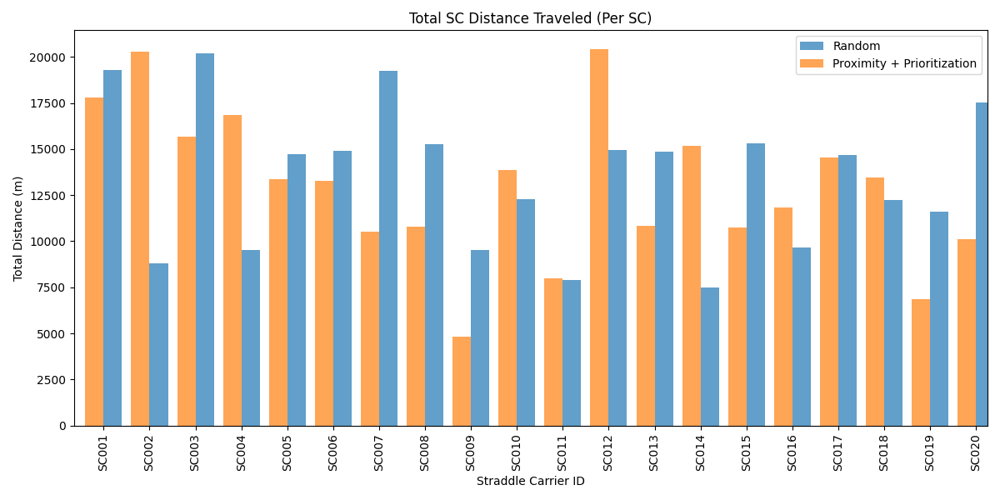

# Straddle Carrier Assignment Optimization: README

## Overview

This project focuses on optimizing the assignment of Straddle Carriers (SCs) to container tasks to minimize key performance metrics such as **total distance traveled**, **idle time**, and **task completion time**. Three different assignment methodologies were implemented and evaluated:

1. **Random Assignment**  
   Assigns SCs to container tasks arbitrarily without any optimization logic.
   
2. **Proximity-Based Assignment**  
   Assigns the closest SC to each container task, prioritizing tasks based on the `time_first_known`.

3. **Mixed-Integer Programming (MIP)**  
   Optimizes SC assignments to minimize the total combined distance traveled while ensuring all tasks are completed in parallel to reduce the overall makespan.

---
## Log File Analysis

The log file contains critical information about the operations of the Straddle Carriers (SCs), including task schedules, travel details, and location usage.

### Key Insights from the Logs:
1. **Travel Details**  
   The logs provide detailed information about the travel distance and duration for each SC while performing tasks.  
2. **Location Usage**  
   The usage of different locations (e.g., QC001, QC003) by SCs is recorded, indicating how resources are allocated during task execution.

### Location Usage Analysis
The bar chart below shows the usage frequency of different locations based on the log file.

**Graph: Location Usage Count**  


## Key Findings

### **Random vs Proximity-Based Assignment**

#### **Random Assignment**
- **Performance:** Inefficient and inconsistent. SCs are often assigned to tasks far from their starting locations, leading to longer travel distances and idle times.
- **Key Observation:** Random Assignment lacks any optimization logic, resulting in poor resource utilization.

#### **Proximity-Based Assignment**
- **Performance:** More efficient than random. SCs are assigned based on their proximity to the task origin, ensuring shorter travel distances.
- **Advantage:** Reduces idle time significantly while ensuring the tasks with earlier `time_first_known` are prioritized.

**Graphs: Random vs Proximity-Based Assignment**  
1. **Total SC Distance Traveled (Per SC):**  
     

2. **Start and Finish Times (10 Random Containers):**  
   

---

### **Proximity vs MIP Assignment**

#### **Proximity-Based Assignment**
- **Performance:** Provides good results but doesn't fully utilize SCs in parallel or optimize the overall makespan.

#### **MIP Assignment**
- **Performance:** Most efficient. MIP ensures that SCs are assigned optimally to minimize the total combined distance traveled and ensures parallel processing of tasks.
- **Advantage:** Tasks are completed in the shortest possible time, minimizing idle times and total travel distances.

**Graphs: Proximity vs MIP Assignment**  
1. **Total SC Distance Traveled (Per SC):**  
     

2. **Total SC Distance Traveled (Combined Sum):**  
     

3. **Start and Finish Times (10 Random Containers):**  
   

---

## Conclusion

### **Key Insights**
1. **Random Assignment:** Inefficient and inconsistent, resulting in higher idle times and travel distances.
2. **Proximity Assignment:** A logical improvement over Random, significantly reducing travel distances and idle times.
3. **MIP Assignment:** Outperforms Proximity by optimizing SC assignments to minimize total combined travel distances and makespan.

### **Recommendation**
For real-world scenarios:
- **Avoid Random Assignment** due to inefficiencies.  
- **Proximity-Based Assignment** is a quick and simple improvement.  
- **MIP Assignment** is the best choice when the goal is to minimize travel distances and ensure efficient resource utilization.

---

## Project Structure

The repository is organized as follows:

```
.
├── data/
│   ├── VOSimu-InputInformation.xlsx  # Input data for locations, vehicles, and container orders
│   └── logger_all.log                # Simulation logs
├── scripts/
│   ├── data_loader.py                # Functions to load and preprocess data
│   ├── assignment_methods.py         # Implementation of assignment methods
│   ├── evaluation.py                 # Evaluation functions to generate KPIs and graphs
│   ├── utils.py                      # Utility functions
├── output/
│   ├── assignments_random.csv        # Assignments from Random method
│   ├── assignments_proximity.csv     # Assignments from Proximity method
│   ├── assignments_mip.csv           # Assignments from MIP method
│   ├── plots/                        # Graphs generated during evaluation
├── main.py                           # Main script to run the assignment and evaluation pipeline
└── README.md                         # Project documentation
```

---

## Installation and Setup

### Prerequisites
- **Python 3.7 or higher**
- Required Libraries:
  - `pandas`
  - `numpy`
  - `matplotlib`
  - `pulp`
  - `deap`
  - `tqdm`

### Installation

1. Clone this repository:
   ```bash
   git clone https://github.com/your-repo/sc-assignment-optimization.git
   cd sc-assignment-optimization
   ```

2. Install dependencies:
   ```bash
   pip install -r requirements.txt
   ```

---

## Running the Project

### Step 1: Prepare Input Data
Ensure the input files (`VOSimu-InputInformation.xlsx` and `logger_all.log`) are placed in the `data/` directory.

### Step 2: Execute the Main Script
Run the optimization pipeline:
```bash
python main.py
```

### Outputs:
- **Optimized Assignment Files**: Saved in the `output/` directory.  
- **Comparison Graphs**: Saved in `output/plots/`.

---

## Evaluation Metrics

### **Key Metrics**
1. **Total Distance Traveled**  
   The combined distance traveled by all SCs for each assignment method.
   
2. **Idle Time**  
   Time spent waiting by SCs before starting their next task.

3. **Task Completion Time**  
   The time taken from when a task is known (`time_first_known`) to when it is completed.

### **Graph Comparisons**
The following graphs are generated to compare the performance of the assignment methods:
1. **Total SC Distance Traveled (Per SC)**  
   Highlights the distance covered by each SC for the various assignment methods.

2. **Total SC Distance Traveled (Combined Sum)**  
   Compares the total combined distance covered across all SCs.

3. **Start and Finish Times for 10 Random Containers**  
   Compares task start and finish times across assignment methods for a random sample of containers.

---

## Future Enhancements
- Introduce penalties for delays and idle times in optimization models.
- Implement advanced algorithms (e.g., Genetic Algorithms, Reinforcement Learning) for real-time adjustments.
- Incorporate live updates for dynamic task reassignment.

---

## Contact

For more details or inquiries:
- **Name:** Tahir  
- **Email:** [tahir.tahir.work@gmail.com](mailto:tahir.tahir.work@gmail.com)  

---
